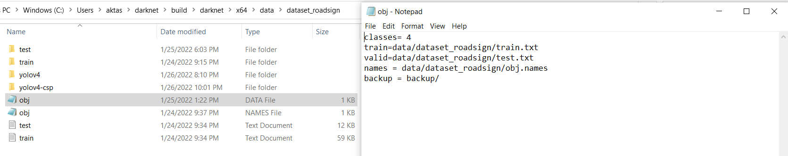

# YOLOV4 Object Recognition 

This repo is forked from https://github.com/AlexeyAB/darknet and will contain the instructions to build and use train, map calculation and test options with YOLOV4 and YOLOV4-CSP.

To be able to use this repo, you need to build the environment first. The following build instructions contains what to do step by step and tested only on <b> Windows </b>.

# Dependencies

PLease use only the referred versions of the dependencies to avoid version conflict

* Download Visual Studio 2019 Community
* Download CUDA Toolkit 11.5 https://developer.nvidia.com/cuda-11-5-0-download-archive?target_os=Windows&target_arch=x86_64&target_version=10&target_type=exe_local 

* Download CUDNN 8.3.0 for CUDA 11.5 https://developer.nvidia.com/rdp/cudnn-archive 

* Download OpenCV 4.5.4 https://opencv.org/releases/ 

Add the dependencies to your system environments as follows (according to your local path):

 

# Build

* Open darknet.sln solution with Visual Studio 2019
* By right click on Solution Explorer at the right side of the window, select properties 

   

* Add the necessary C/C++ libraries as follows

   

* Add the necessary Linker libraries as follows

   

* Add some additional Linker libraries as follows

   

* To avoid <b> Error MSB4019 The imported project "C:\Program Files(x86)\Microsoft Visual Studio\2019\Community\MSBuild\Microsoft\VC\v160\BuildCustomizations\CUDA 10.1.props" was not found.  </b> error, please copy the following files to the 
<b> C:\Program Files(x86)\Microsoft Visual Studio\2019\Community\MSBuild\Microsoft\VC\v160\BuildCustomizations\ folder. </b> and change darknet.vcxproj properties by writing 11.5 instead of 10.1 in the following 2 lines:

   

  

* Now you should be able to build the solution by clicking build button and obtain  <b> darknet.exe </b> application: 

   

# RUN

Before starting to train and test your models, there are a few steps more to do. 

* Add the following .dll files to the same folder with darknet.exe application. <b> Your darknet.exe application should be in darknet/build/darknet/x64/ </b>

  

* You must have obtained 2 more blocks in your project properties after the build is complete. Now you should add some additional directories as follows:

  

  

# TRAIN

## YOLOV4

To train your custom model using pre-trained weights (which I do usually to have a better and faster accuracy):

* Download the <b> pretrained weights </b> for Yolov4 https://github.com/AlexeyAB/darknet/releases/download/darknet_yolo_v4_pre/yolov4-csp.conv.142 

* Arrange <b> obj.names </b> file by writing the class names in your dataset with the same order of ID's you put while labeling your data

  

* Arrange <b> obj.data </b> file by giving train and validation dataset path (so you should have  <b> train.txt and test.txt </b> files having the full path of your images) and some additional info as follows: 

  

  

* You can use folder_to_txt.py script in scripts folder to obtain train.txt and test.txt files from your dataset folder.
  
* Arrange yolov4_custom.cfg file that you can find in cfg folder. 
  *  You need to change classes= line according to the number of classes in your dataset
  *  You need to change filters= line coming just before yolo layer to the amount of 
  (class_number + 5)x3 . For example, for my sample case I had 4 classes and I arranged the .cfg file as follows. There are 3 of each of them so don't forget to change all!

    

* Now with the following command you can start your first train! (Of course by changing the file names according to your files)

  <b> darknet.exe detector train data/dataset_roadsign/obj.data cfg/yolov4_roadsign.cfg weights/pretrained/yolov4.conv.137 </b>

* You will obtain the following chart and <b> your saved weights in backup/ folder
 </b>

  

# MAP Calculation

## YOLOV4

After or during the training of your model, you can just stop the model for a moment and check the mAP using your validation dataset to understand if the model gets overfitting or your train loss - accuracy is trustable. To do this, you can use the following command:

* darknet.exe detector map data/dataset_roadsign/obj.data cfg/yolov4_roadsign.cfg backup/yolov4_roadsign_final.weights -iou_thresh 0.50  

So the data and cfg files are the same but I use the weights come from my training process.

## YOLOV4-CSP

In the base source, there are different implementations of YOLOV4 with some different activation functions or little changes on the architecture. YOLOV4-CSP is one of them and to use it, the only thing you should do is download the pre-trained weights for this architecture and arrange yolov4-csp_custom.cfg file as explained for YOLOV4. Train, map calculation and test commands are also the same except of the name of the file.    

  - pre-trained weights for training: https://drive.google.com/open?id=1JKF-bdIklxOOVy-2Cr5qdvjgGpmGfcbp

# Some Possible Errors and Their Solutions

# Configuration File Explanation

